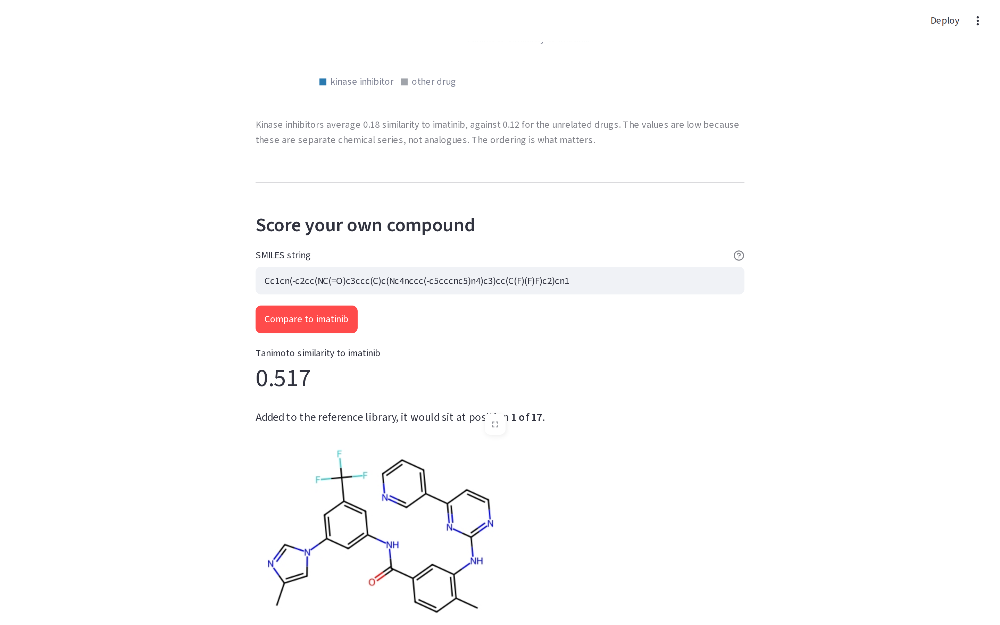
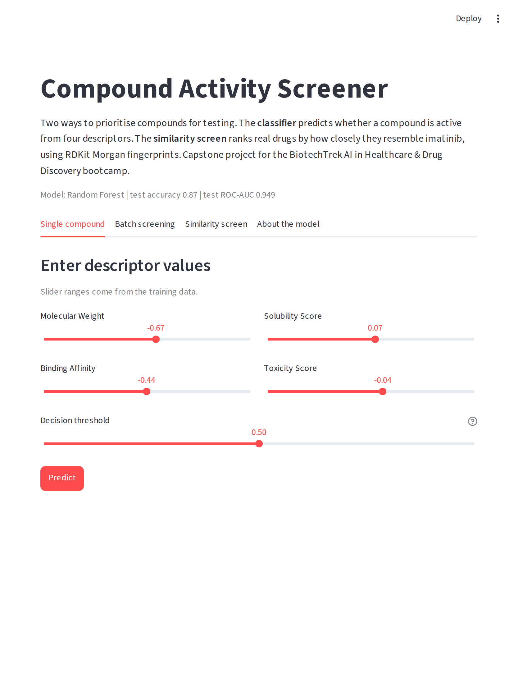
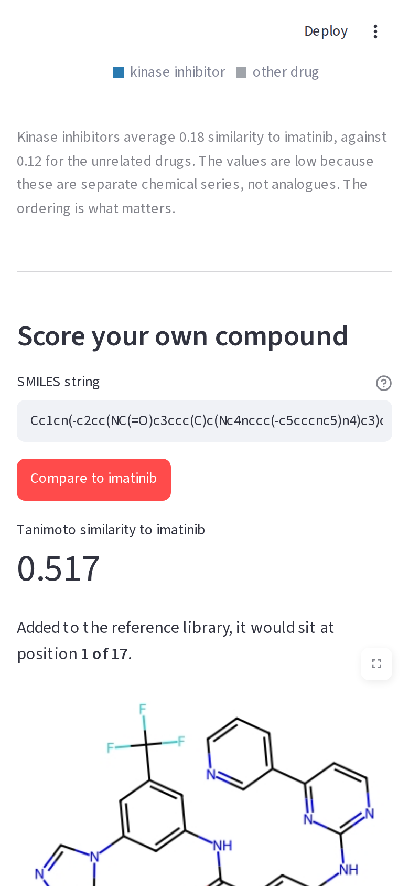

# Compound Activity Screener

Capstone project for the **BiotechTrek AI in Healthcare & Drug Discovery Bootcamp** (Option C: drug screening).

Virtual screening ranks candidate compounds so that only the most promising ones go to the laboratory. This project does that in two ways:

- **Part A, a classifier.** Predicts whether a compound is active or inactive from four descriptors, compares five models with stratified cross-validation, and ranks compounds by predicted probability. The data is simulated with `make_classification`, as the project brief specifies.
- **Part B, real chemistry.** Takes 17 approved drugs, computes RDKit descriptors from their actual structures, and ranks them by Morgan fingerprint similarity to **imatinib**.

## Results

**Part A, held-out test set (100 compounds)**

| Metric | Score |
|---|---|
| Accuracy | 0.87 |
| Precision | 0.89 |
| Recall | 0.84 |
| F1 | 0.87 |
| ROC-AUC | 0.949 |

Random Forest was selected on cross-validated ROC-AUC (0.932). Logistic regression reached only 0.736, because part of the signal is non-linear. All four descriptors contribute: binding affinity and molecular weight most, then toxicity score and solubility score.

**Part B, similarity screen**

Dasatinib is the closest library drug to imatinib (Tanimoto 0.275), and kinase inhibitors take four of the top five places against a 50% base rate, a 1.6x enrichment. Nicotine ranks third, a false positive caused by its small size. Nilotinib, a genuine imatinib analogue that is not in the library, scores 0.517.

## The app

Four tabs: single-compound prediction with an adjustable threshold, CSV batch screening, the imatinib similarity screen with a box to score any SMILES string, and a model summary.



 

## Avoiding data leakage

- The train/test split happens before any preprocessing
- Scaling sits inside a `Pipeline`, so it only ever learns from training folds
- Model comparison and tuning use cross-validation on the training set alone
- The test set is scored once, at the end

## Files

| File | Purpose |
|---|---|
| `drug_screening_capstone.ipynb` | Full analysis, Parts A and B, with outputs |
| `app.py` | Streamlit app |
| `candidate_library.csv` | The 17 drugs with descriptors, SMILES and similarity scores |
| `sample_compounds.csv` | Example file for batch screening |
| `requirements.txt` | Python packages |
| `packages.txt` | System libraries RDKit needs to draw molecules on Streamlit Cloud |
| `docs/` | Screenshots |

## Running it

```
pip install -r requirements.txt
streamlit run app.py
```

The app rebuilds the notebook's final model from the same seed when it starts, instead of loading a saved model file. A saved scikit-learn model is tied to the version that wrote it, and a hosting server may install a newer one.

## Limitations

The Part A data is simulated, so its metrics show that the workflow is sound, not that the model works on real chemistry. For that reason the classifier is not applied to the real molecules in Part B. Training on real molecules needs measured activity data, such as IC50 values from ChEMBL, and that is the next step.

---
Live url:  https://compound-activity-screener.streamlit.app/
